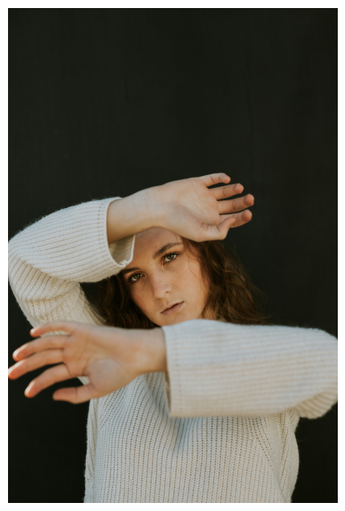
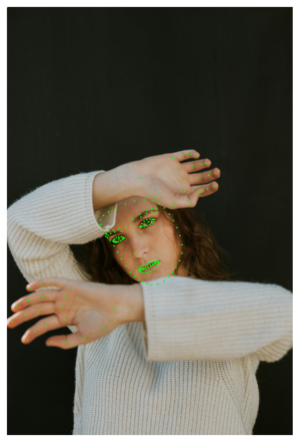

# 1. Project Overview

## Table of Contents
- [Problem Domain and Brief Problem Description](#problem-domain-and-brief-problem-description)
- [High Level Approach](#high-level-approach)
- [Results](#results)

## Detailed Writeup
- [Step 1: Data Preparation](#step-1-data-preparation)
- [Step 2: Key Points using MP Holistic](#step-2-key-points-using-mp-holistic)
    - [What is MP Holistic?](#what-is-mp-holistic)
    - [Sources and References](#sources-and-references)
- [Step 3: Building and Training a 3D CNN Neural Network](#building-and-training-a-3d-cnn-neural-network)
    - [Sources and References](#sources-and-references)
---

## Problem Domain and Brief Problem Description
1-2 paragraphs describing what your goal is (what are the inputs and outputs of the system you are considering), what are example data input and output, and who would care about this problem.

## High Level Approach

What is the high-level approach that you are taking? What datasets are you using? What makes the approach difficult, or not so difficult? How much data are you using? Are there any problems with that data?

## Results

How do the results relate to alternative approaches to the same problem? Does this “solve” the problem for real use cases, or are there still things needed before your approach is useful?

---

# 2. In Depth Writeup

## Step 1: Data Preparation

## Step 2: Key Points using MP Holistic

### What is MP Holistic?

The MediaPipe (MP) Holistic is a full-body landmark detection tool that combines components of the pose, face, and hand landmarkers in order to create a complete landmarker for the human body. It achieves this by running a machine learning model on a continuous stream of images. It is designed to run in real time, which is ideal for our purposes.

It takes in an image of the human body, and outputs:
- 33 pose landmarks
- 468 face landmarks
- 21 hand landmarks (per hand)

  
  

You can see in the above example image the landmarks across the face and hands the we are using to define the pose.

We then parse that output and use it as the input for our neural network that is trained in the next step.

## Step 3: Building and Training a 3D CNN Neural Network
